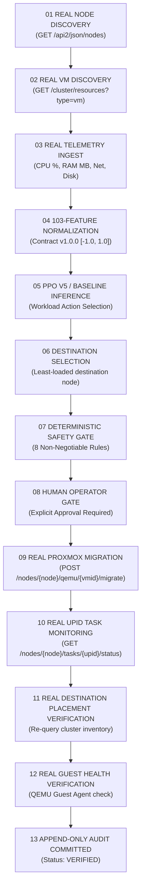

# VMotion AI — Real Infrastructure Integration Specification & Proxmox Live Contract

> **System Status**: Engineering-Complete Control Plane Foundation  
> **Primary Real-Provider Path**: Proxmox VE REST API v2 (`ProxmoxVEProvider`)  
> **Secondary Future Provider**: Linux KVM / Libvirt (`LibvirtKVMProvider`)  
> **Target Release**: Proxmox VE 9.x/current supported release (currently 9.2), x86_64, with hardware virtualization enabled  
> **Verification Status**: Code-Complete, Unit-Tested, Mock-Tested, Real Hardware Pending  
> **Last Updated**: 2026-09-19  

---

## 1. Architectural Topology & Separation of Concerns

VMotion AI operates as an out-of-band supervisory control plane. The software never executes inside guest VM kernels or hypervisor kernel modules; it communicates exclusively via authenticated HTTPS REST interfaces.

```
+-------------------------------------------------------------------------------+
|                       WINDOWS OPERATOR WORKSTATION                            |
|       - FastAPI Backend (Port 8000)      - React Frontend (Vite)              |
|       - 103-Feature Ingestion Adapter    - Frozen PPO V5 ML Policy            |
|       - Deterministic Safety Gate        - Append-Only Audit Ledger           |
+-------------------------------------------------------------------------------+
                                        │
                                        │ HTTPS REST API (Port 8006)
                                        │ Scoped API Token Auth
                                        ▼
+-------------------------------------------------------------------------------+
|                         PROXMOX VE HYPERVISOR CLUSTER                         |
|                                                                               |
|   +-----------------------------+             +---------------------------+   |
|   |         REAL NODE A         |             |        REAL NODE B        |   |
|   |  - Proxmox VE 9.x / current |             |  - Proxmox VE 9.x / curr. |   |
|   |  - pve-cluster (Corosync)   |<===========>|  - pve-cluster (Corosync) |   |
|   |  - Static IP                |   Cluster   |  - Static IP              |   |
|   |                             |   Network   |                           |   |
|   |   +---------------------+   |             |   +-------------------+   |   |
|   |   |   REAL TEST VM      |   | (TCP 60000- |   | (Target Capacity) |   |   |
|   |   |   - Linux Guest     |---|---60050)---►|   | - Idle Headroom   |   |   |
|   |   |   - QEMU Guest Agt  |   |             |   | - Reserved Memory |   |   |
|   |   +---------------------+   |             |   +-------------------+   |   |
|   +-----------------------------+             +---------------------------+   |
+-------------------------------------------------------------------------------+
```

---

## 2. Real Proxmox Contract Lifecycle

Every live operation follows a strict 13-stage deterministic lifecycle without exception:



---

## 3. Mandatory Prerequisite: Manual Migration First

> [!CRITICAL]
> **MANDATORY MANUAL MIGRATION RULE**:
> Before VMotion AI is ever permitted to dispatch a live migration via API:
> 1. The underlying Proxmox cluster must first successfully live-migrate the test VM manually from the Proxmox Web GUI or CLI:
>    ```bash
>    qm migrate <vmid> node-02 --online 1 --with-local-disks 1
>    ```
> 2. The operator must confirm that memory convergence finishes, the guest OS remains responsive, and no kernel panic or network disconnect occurs.
> 3. **Only after this manual test succeeds will VMotion AI be connected to control migrations.**

---

## 4. Exact Requirements for the Real Proxmox Cluster

### 4.1 Compute Node Specifications
- **Number of Hosts**: Exactly 2 physical or nested hypervisor nodes (Node A and Node B).
- **CPU**: Minimum 4 cores per node (x86_64, hardware virtualization VT-x/AMD-V enabled).
- **RAM**: Minimum 8 GB per node. Destination host must have unallocated free RAM exceeding the VM allocation $+ 20\%$.
- **Operating System**: Proxmox VE 9.x/current supported release (currently 9.2), x86_64, with hardware virtualization enabled.
- **Cluster State & Quorum Considerations**:
  - Clustered via `pvecm create` / `pvecm add`.
  - **Quorum Dynamics**: A standard 2-node cluster requires both nodes online to maintain majority quorum (requires $\ge 2$ out of 2 votes, $> 50\%$). If one node disappears or communication fails, the remaining node drops below quorum ($1/2 = 50\%$) and enters an unquorate read-only state, blocking migrations and VM modifications.
  - **QDevice Option**: To provide quorum resilience in a 2-node topology, an external lightweight QDevice (via `corosync-qnetd` on an independent host or gateway) can be registered (`pvecm qdevice setup <qnetd-host>`) to provide a 3rd tie-breaker vote.
  - **Design Limitation**: A 2-node cluster without an external tie-breaker is strictly a laboratory test topology and must NOT be considered equivalent to a production fault-tolerant 3+ node high-availability design.

### 4.2 Test VM Workload Specification
- **Guest OS**: Lightweight Linux (Alpine Linux 3.19 or Debian 12 Minimal).
- **vCPUs**: 1–2 cores.
- **RAM**: 1024 MB or 2048 MB.
- **Disk**: 10 GB disk image.
- **Guest Agent**: `qemu-guest-agent` installed, enabled, and running inside the VM:
  ```bash
  systemctl enable --now qemu-guest-agent
  ```

---

## 5. Required Networking

1. **Management & API (Control Plane to Hypervisors)**:
   - Port: `TCP 8006` (HTTPS REST API).
   - Ingress from Windows control workstation to both Proxmox node management IPs.
2. **Node-to-Node Live Migration Stream**:
   - Ports: `TCP 60000–60050` (dedicated QEMU live migration memory transfer; encryption subject to cluster configuration).
   - Latency: $< 5\text{ ms}$ between Node A and Node B.
   - MTU: Standard 1500 (or 9000 jumbo frames if supported by the network switch).
3. **Cluster Quorum (Corosync)**:
   - Ports: `UDP 5405–5412` between Node A and Node B.
4. **SSH Inter-Node Sync**:
   - Port: `TCP 22` between Node A and Node B (used by Proxmox for cluster tunnel and configuration synchronization).

---

## 6. Required Storage

Live migration requires that the guest disk image is either accessible on the destination or replicated during the migration stream. Neither is an absolute architectural requirement; both configurations are supported:

- **Option A (Shared Storage)**:
  - NFSv4 or Ceph datastore mounted with identical storage ID (e.g. `nfs-shared`) on both Node A and Node B.
  - VM disk resides on the shared storage; migration only transfers RAM pages.
- **Option B (Local Storage with Live Block Mirroring)**:
  - VM disk resides on local storage (ZFS or LVM-thin).
  - Live migration uses Proxmox's `--with-local-disks 1` parameter (already implemented in `ProxmoxVEProvider.execute_migration`), which activates QEMU NBD live block mirroring.

---

## 7. Required API Permissions (Audited against Proxmox VE 9.x)

To maintain least-privilege security, VMotion AI must NOT use the root administrator password. The permission set is strictly derived from the actual API calls implemented in `backend/app/providers/proxmox.py`:

| API Operation in VMotion AI | Proxmox VE REST Endpoint | Required Privilege (PVE 9.x) | Justification |
| :--- | :--- | :--- | :--- |
| **Node Discovery & System Status** | `GET /api2/json/nodes` | `Sys.Audit` | Read node hardware utilization (CPU, RAM, Disk). |
| **Cluster VM Inventory** | `GET /api2/json/cluster/resources?type=vm` | `VM.Audit` | Enumerate VM IDs, host nodes, and runtime states. |
| **VM Operational State** | `GET /nodes/{node}/qemu/{vmid}/status/current` | `VM.Audit` | Inspect running status, allocated memory, CPU load. |
| **Live Migration Dispatch** | `POST /nodes/{node}/qemu/{vmid}/migrate` | `VM.Migrate` | Trigger live migration to destination node. (`VM.Allocate` is not explicitly called by the implemented endpoint; verify with `pveum user token permissions` whether Proxmox internally requires it for migration.) |
| **Local Disk Migration Replication** | `POST .../migrate` with `with-local-disks=1` | `Datastore.AllocateSpace` | Allocate target disk blocks on destination datastore. |
| **Storage Verification** | Queried during migration pre-checks | `Datastore.Audit` | Verify shared or target datastore status. |
| **Task Progress Polling** | `GET /nodes/{node}/tasks/{upid}/status` | `Sys.Audit` | Poll UPID completion state and exitstatus. |
| **Guest-Agent Health Check** | `POST .../qemu/{vmid}/agent/ping` | `VM.GuestAgent.Audit` | Trigger guest responsiveness ping via virtio-serial agent. |

*Note on Deprecated Privileges*: `VM.Monitor` is **not** a valid privilege in Proxmox VE 9.x and has been removed from all documentation.

### Least-Privilege Role & Token Creation Recipe
```bash
# 1. Create dedicated least-privilege role matching exact VMotion AI endpoints.
#    VM.Allocate is excluded: the implemented migrate endpoint does not call
#    a VM allocation API. If Proxmox internally requires it, add it after
#    verification with the command in step 5.
pveum role add VMotionOperator -privs "VM.Migrate VM.Audit VM.GuestAgent.Audit Datastore.Audit Datastore.AllocateSpace Sys.Audit"

# 2. Create unprivileged automation user.
pveum user add vmotion-api@pve -comment "VMotion AI Control Plane Automation"

# 3. Bind role to user (covers API operations when token privilege separation is on).
pveum acl modify / -user vmotion-api@pve -role VMotionOperator

# 4. Generate API token WITH privilege separation (token scope bounded by its own ACL).
pveum user token add vmotion-api@pve automation -privsep 1

# 5. Assign the same role directly to the token principal so the token itself
#    holds the effective privileges (required when privsep=1).
pveum acl modify / -user vmotion-api@pve!automation -role VMotionOperator

# 6. Verify effective token permissions before claiming least-privilege.
#    Do NOT assert least-privilege until this output confirms the exact scope.
pveum user token permissions vmotion-api@pve automation
```

---

## 8. Definitive Live Integration Checklist

Before initiating live mode in VMotion AI, verify every item:

- [ ] **1. Two Hypervisor Nodes Running**: Node A and Node B are online with Proxmox VE 9.x/current supported release (currently 9.2).
- [ ] **2. Quorum Established**: `pvecm status` reports both nodes online. (If single-node failure tolerance is needed in 2-node lab, QDevice configured).
- [ ] **3. Network Ports Open**: TCP 8006 accessible from Windows workstation; TCP 60000–60050 open between nodes.
- [ ] **4. Test VM Created**: VM running on Node A with `qemu-guest-agent` active.
- [ ] **5. Storage Ready**: Shared NFS mount verified OR local disk with NBD mirroring ready.
- [ ] **6. Manual Live Migration Verified**: Manual `qm migrate` executed outside VMotion AI and succeeded cleanly.
- [ ] **7. API Token Created**: Token generated with `-privsep 1`, role assigned to token principal, effective permissions verified with `pveum user token permissions vmotion-api@pve automation`. Minimum privileges: `VM.Migrate`, `VM.Audit`, `VM.GuestAgent.Audit`, `Datastore.Audit`, `Datastore.AllocateSpace`, `Sys.Audit`. (`VM.Allocate` omitted pending verification — add if Proxmox requires it for migration internally.)
- [ ] **8. VMotion AI Settings Configured**: Endpoint, User, Token ID, and Token Secret entered in Settings modal.
- [ ] **9. Connection Test Passes**: Clicking "TEST PROXMOX CONNECTION" returns `CONNECTED` with valid node count and latency.
- [ ] **10. Live Mode Activated**: Operator enters security key and toggles to `LIVE: PROXMOX`.
